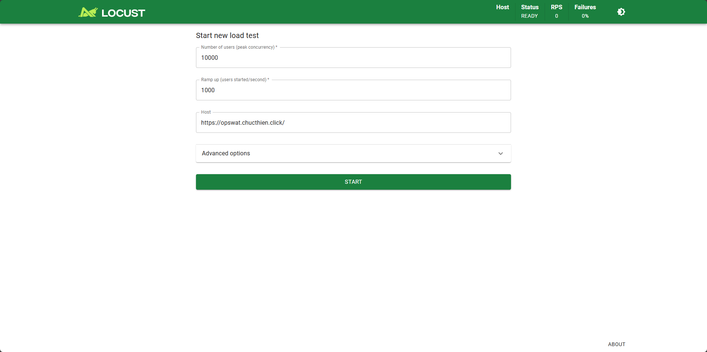
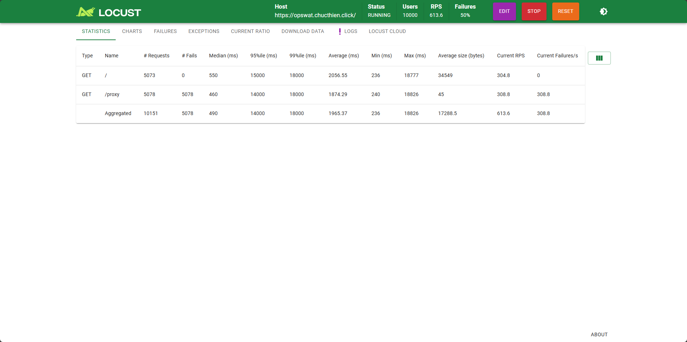
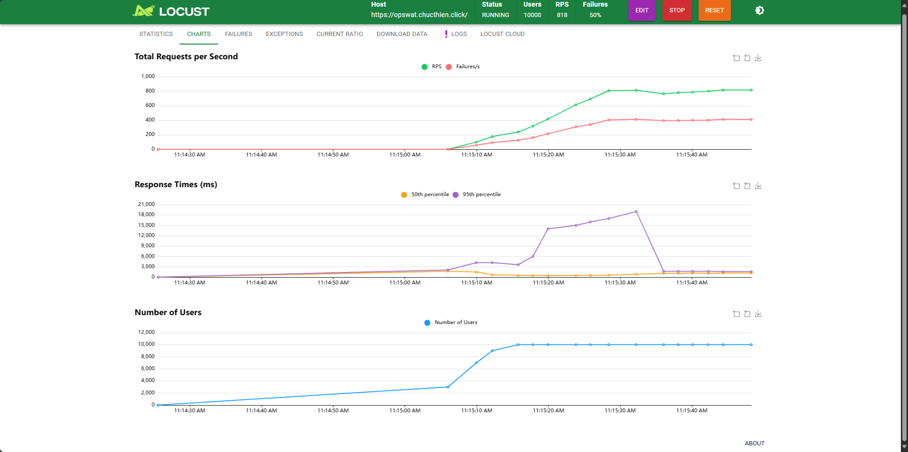

# ☕️ Go CoffeeShop - Deployment Guide

This document outlines the deployment procedures for the Go CoffeeShop application, covering both local development and production environments. It details the configurations for Docker Compose and Kubernetes on Amazon EKS with ArgoCD for GitOps.

---

## 📜 Menu

-   **📦 Local Development Environment (Docker Compose)**
    -   🔹 `docker-compose.yml` (Private ECR Images)
    -   🔹 `docker-compose-public.yml` (Public DockerHub Images)
-   **📁 Production Deployment (Kubernetes on EKS)**
    -   📂 `argoCD/`
    -   📂 `external_secret_operator/`
    -   📂 `ingress/`
    -   📂 `monitoring/`
    -   📂 `manifest/`
        -   📂 `product/`
        -   📂 `counter/`
        -   📂 `barista/`
        -   📂 `kitchen/`
        -   📂 `web/`
        -   📂 `proxy/`
        -   📂 `rabbitmq/`

    -   🛠 Applying Kubernetes Manifests (Production)
        -   Using ArgoCD and Helm
        -   Applying Manually
-   **📂 Locust**
-   **📄 Notes**
-   **📚 Public DockerHub Images**
-   **📬 Contact**

---

## 📦 Local Development Environment (Docker Compose)

Two `docker-compose` configurations are provided to facilitate local development and EC2 setups. After run these commands bellow, the web will availabel at http://localhost:8888

### 🔹 `docker-compose.yml` (Private ECR Images)

This setup utilizes **private Docker images** hosted on **Amazon Elastic Container Registry (ECR)**. It's designed for practicing with AWS ECR.

⚠️ **Important:** Ensure you are authenticated with AWS ECR before running the Docker Compose command. This typically involves using `aws ecr get-login-password` followed by `docker login`.

To launch the services using private ECR images, execute the following command in your terminal:

```
docker-compose -f docker-compose.yml up -d
```

### 🔹 `docker-compose-public.yml` (Public DockerHub Images)

This configuration uses **public Docker images** available on **Docker Hub**.

To start the services using public Docker images, run:

```
docker-compose -f docker-compose-public.yml up -d
```

✅ **Benefit:** Ideal for testing and development without requiring AWS credentials.

-----

## 📁 Production Deployment (Kubernetes on EKS)
Kubernetes manifests for production deployment are organized within the `manifest/` directory, structured by component and feature.
### 📂 `argoCD/`

Contains manifests for setting up ArgoCD in the Kubernetes cluster.

  - `install.yaml`: Deploys the ArgoCD control plane.
  - `app_project.yaml`: Defines an ArgoCD project for the CoffeeShop application.
  - `argo-manifest.yml`: An ArgoCD `Application` resource to synchronize CoffeeShop services.

    ```bash
    # Creates a new namespace named 'argocd'.
    kubectl create namespace argocd

    # Deploys ArgoCD components into the 'argocd' namespace.
    kubectl apply -n argocd -f [https://raw.githubusercontent.com/argoproj/argo-cd/stable/manifests/install.yaml](https://raw.githubusercontent.com/argoproj/argo-cd/stable/manifests/install.yaml)

    # Retrieves the initial admin password for ArgoCD.
    argocd admin initial-password -n argocd

    # Forwards port 443 of the ArgoCD server to localhost:8888 for local access.
    kubectl port-forward -n argocd svc/argocd-server 8888:443

    # Retrieves and decodes the initial admin password from a Kubernetes secret.
    kubectl -n argocd get secret argocd-initial-admin-secret -o jsonpath="{.data.password}" | base64 -d && echo

    # Creates/updates the ArgoCD AppProject resource.
    kubectl apply -n argocd -f argoCD/app_project.yaml

    # Creates/updates the ArgoCD Application resource.
    kubectl apply -n argocd -f argoCD/argo-manifest.yml
    ```


### 📂 `product/`, `counter/`, `barista/`, `kitchen/`, `web/`, `proxy/`

Each directory represents a CoffeeShop service and includes:

  - `*-deployment.yaml`: Kubernetes Deployment for managing service pods.
  - `*-config.yaml`: Kubernetes ConfigMap or Secret for service configuration.
  - Service Definition (`*-service.yaml`): Exposes the service within the cluster (if needed).
  - `kustomization.yaml`: Kustomize file for environment-specific customizations.

### 📂 `rabbitmq/`

Manifests for deploying the RabbitMQ message broker:

  - Deployment definition for RabbitMQ pods.
  - Service definition to expose RabbitMQ.
  - ConfigMap for RabbitMQ configuration.

### 📂 `external_secret_operator/`

Integration with AWS Secrets Manager using the External Secrets Operator:

  - `ExternalSecret` resources to fetch secrets.
  - `SecretStore` configuration for AWS Secrets Manager connection.
  - `kustomization.yaml` to manage External Secrets.

### 📂 `ingress/`

Ingress routing configuration using Traefik:

  - Ingress resource definitions for external service exposure.
  - Middleware configurations for request handling.
  - Value overrides for Traefik Helm chart (if used).

### 🛠 Applying Kubernetes Manifests (Production)

Choose the method based on your deployment strategy:

**Using ArgoCD (Recommended):**

1.  Install ArgoCD:

    ```
    kubectl apply -f manifest/argoCD/install.yaml
    ```

2.  Create the ArgoCD Application to manage CoffeeShop services:

    ```
    kubectl apply -f manifest/argoCD/argo-manifest.yml
    ```

**Applying Manually:**

  - Apply all manifests using `kubectl` and Kustomize:

    ```
    kubectl apply -f manifest/argoCD/argo-manifest.yml
    ```


---

## 📂 Locust/
This directory contains Locust files used for load testing the application.

**What is it?**

- Locust is an open-source load testing tool. It allows to simulate a large number of concurrent users accessing your application to measure its performance under load. In this context, it's used to assess how the application behaves with increasing user traffic, helping to identify potential bottlenecks, performance issues or i use for checking HPA status.

**What is it used for?**

* **Performance Testing:** Evaluating the application's responsiveness and stability under normal and peak load.
* **Scalability Testing:** Determining the application's ability to handle increasing numbers of users or requests.
* **Identifying Bottlenecks:** Pinpointing areas in the application that become slow or fail under load.


**Example Explanation:**
The provided Python code defines a simple Locust user (`MyUser`) that:

* Waits between 1 and 3 seconds between requests (`wait_time = between(1, 3)`).
* Simulates users accessing two endpoints:
    * `https://opswat.chucthien.click` (`test_endpoint_1`)
    * `https://opswat.chucthien.click/proxy` (`test_endpoint_2`)

To run this, you would save the code as a Python file (e.g., `locustfile.py`) and then execute Locust from the command line, pointing it to this file.
  ```bash
    # Install Locust
    pip3 install locust

    # Validate your installation
    locust -V

    # Run -> then press enter and finally check the endpoint http://localhost:8089/
    locust -f locustfile.py
  ```
- ### Locust Start New Load Test
  

- ### Locust Load Test Statistics
  

- ### Locust Load Test Charts
  
---

## 📄 Notes

  - `web/old.web-service-loadbalancer.yaml` is **deprecated**.
  - `web/test.yaml` is for **debugging/internal testing only**.

----


## 📬 Contact

For any questions or assistance, please feel free to reach out.

## 📬 References
https://argo-cd.readthedocs.io/en/stable/getting_started/
